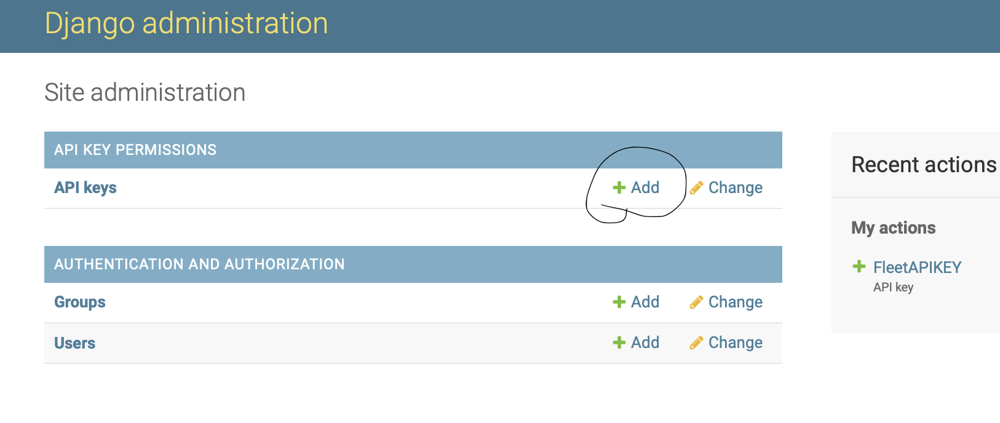
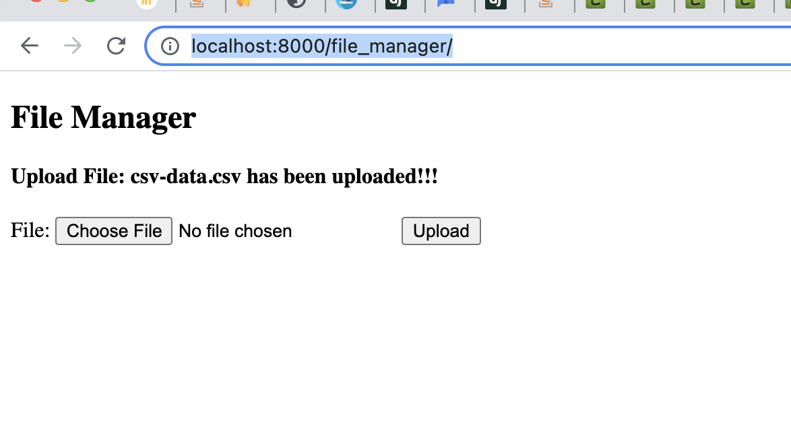

### Fleet Management


#### Pre requisites:
1. Install and start Redis server (https://redis.io/download)
2. Install and start postgres server (https://www.postgresql.org/download/)

    **To start manually:**
    ```pg_ctl -D /usr/local/var/postgres start```
    
    **To stop manually:**
    ```pg_ctl -D /usr/local/var/postgres stop```
    
    **To start PostgreSQL server now and relaunch at login:**
    ```brew services start postgresql```
    
    **To stop PostgreSQL:**
    ```brew services stop postgresql```

3. Install python venv to avoid installing dependencies inside the source python
4. Activate the python venv and install dependencies from requirements.txt ```pip3 install -r requirements.txt```
5. Keep fleetprojects as the root folder
6. Run ```python manage.py migrate``` to migrate baseline schemas

#### How to run:
1. Run ```python feed_processor/vehicle_data_listener.py```
2. Run ```celery -A fleetmanager worker --loglevel=INFO``` (Run celery worker)
3. Run ```celery -A fleetmanager beat -l info``` (Run celery cron job)
4. Finally run ```python manage.py runserver```
    OR
5. Run the honcho way: ```honcho start``` (will spin all the above in different processes defined in Procfile)


---

Note: 
Prior to accessing APIs, make sure to setup authorization key from django admin:

And add it as one of the headers in the request:
Header key: **Fleet-Api-Key**, value: API KEY

OR

Disable Auth, by commenting out the following in project settings.py:
```
REST_FRAMEWORK = {
     'DEFAULT_PERMISSION_CLASSES': [
         'rest_framework_api_key.permissions.HasAPIKey',
     ]
 }
``` 

### File Uploads:
1. To upload with vin number, license plate and tire attributes should use: 
``` http://localhost:8000/file_manager/```

2. Use the same (file manager) to upload json file with other gps, fuel level, battery level attributes

Note: In real world, this will happen as server-server communication

### API Documentation

#### Endpoints:
 * [Customer Endpoints](customer-api.md)
 * [Vehicle Data Endpoints](vehicle-data-api.md)
 * [Task Endpoints](task-api.md)


