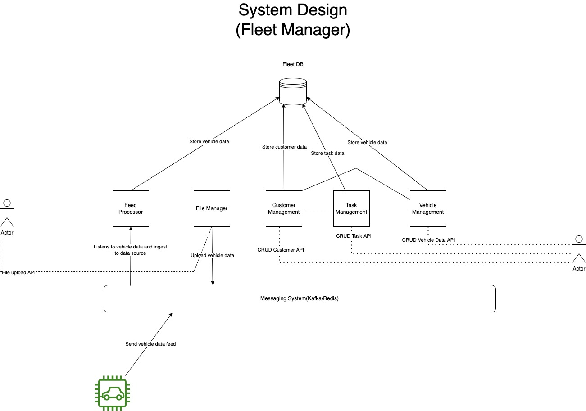

---

### System Design:

#### Main Components Overview:
1. **feed_processor** : Process feeds and listens to message channel for vehicle data.
2. **file_manager** : Takes care of file uploads (simple UI to upload csv and json file: _simulating json server-server communication through file upload_).
3. **msg_pattern** : Custom Publish-Subscribe class (used Redis)
4. **vehicle_management** : Contains all the apis, to perform CRUD operations on vehicle and customer data.
5. **task_management** : Manages tasks
6. **customer_management** : Manages customers

* ```Note: All heavy tasks are carried over by background job (through workers)``` 
---
#### Entities:
1. **Customer**: Contains customer's data
2. **Vehicle**: Contains vehicle's main data
3. **VehicleStatus**: Contains vehicle's attributes data
4. **Task**: Contains task related data (status: created, complete, canceled)
5. **Rule**: Contains rule with patterns and actions (_send email, store log, create task_)

#### Standard Flow:
1. Use file manager to upload csv and json
2. Once done, all the vehicle data will be populated in the database (we can perform CRUD whenever we want)
3. Attach customers to vehicles
4. Add tasks with/without rules
5. If rules are added, as soon as the defined rule pattern is met, the action attached to rule gets triggered

---

#### Future Enhancements:
1. **Redis** can be replaced by **Kafka**
2. The **APIs** are **limited** to the scope of the **requirements**, in future we can add more API to perform CRUD on all the apps (Rules, Tasks) etc.
Right now, all the crud operations can be performed on Vehicle Data, whereas for others it is limited
3. Move the **uploaded files** to **blob storage (S3 bucket)**, and keep path to those in tables
4. Add **test cases to mitigate the bugs** before merging anything to branches 
5. **Containerize** to avoid dependency issues related to OS environments
6. **Horizontal scaling** to support high traffic
7. **Load balancers** to distribute API requests among pods
